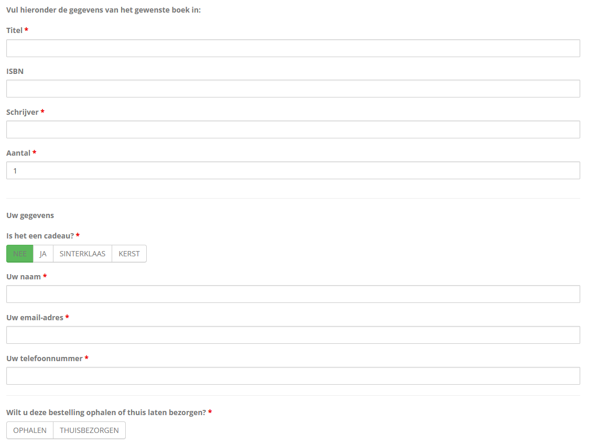

import DownloadButton from "../../components/download-button/download-button.astro"

<DownloadButton title="Website" link="https://boekhandelbijleveld.nl" />

# Bijleveld website

During the 2020 COVID-19 pandemic, local bookstore Bijleveld needed to supply their customers without using the physical store. Tungstun helped them create an online presence. This way they could update opening times, upload newsletters and most of all connect with customers to bring books right to their home.

## Features

- Show opening times
- Contact information
- Location service

- Bookstore news
- About section
- Photo reel showing the history of the store
- Instagram embed
- Newsletter integration
- Book order form
- Contact form

## Book ordering

Bijleveld wanted to give customers the opportunity to reserve books online but did not want the overhead of managing a complete online store. Together we came to the conclusion that a complex ordering form would be the best solution. You can input the title of the book and your contact info, within a day the bookstore personally replies with the next steps. This way even obscure books can be queried by the customer. This is a human centered approach that suits the bookstore very well.

_Book ordering form_

