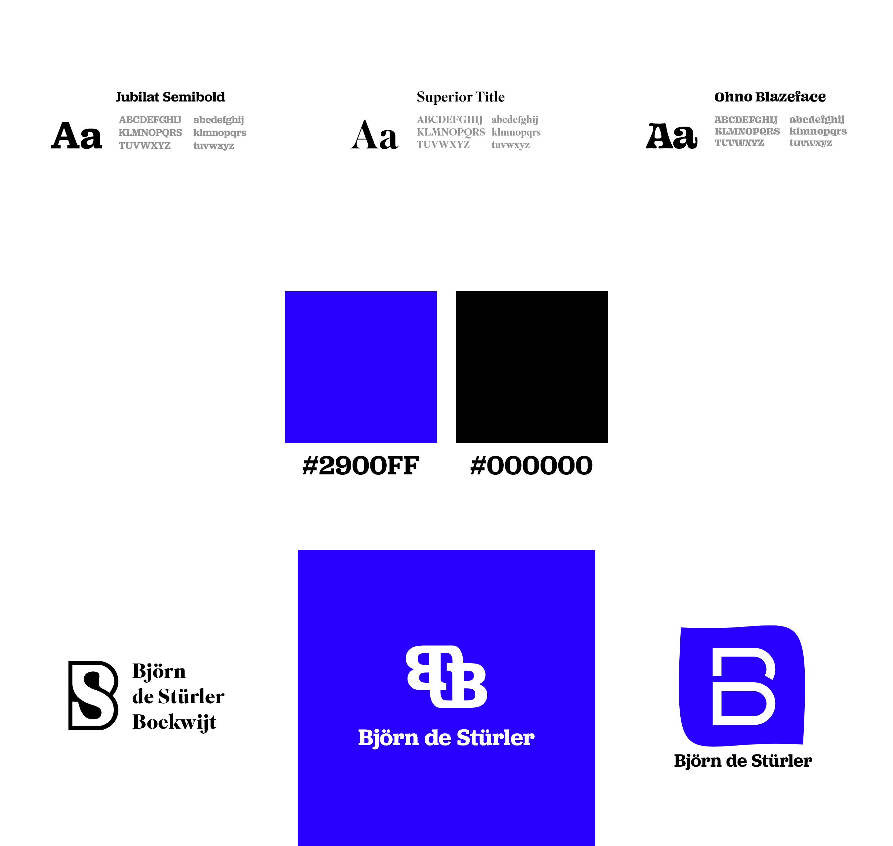
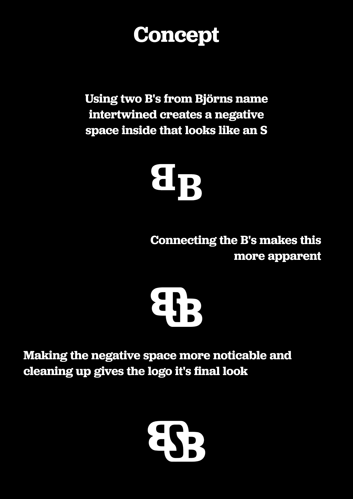

# Logo Björn de Stürler

Björn de Stürler needed a logo for his independent (zzp) company. He is a data analyst that works with data to create new strategies and / or analyse the work. He did not have a professional logo to use on his website and business cards. This is where Tungstun could help to elevate his business to the next level.

## First concepts

### Concept 1 

If Bjorn wanted a bit of a playful style to his logo, this was my option to do so. It gives a bit of a 70's vibe with a round, flairful font. It combines the S with the outline of a B to incorporate both first letters of his name.

### Concept 2

This gives more of a high class, jewelery like vibe that looks very professional yet is very personal. 2 B's for his first name and last name where the negative space is shaped like an S.

### Concept 3

Bjorn stated that he wanted simplicity in his logo. To take this to the extreme concept 3 was created. It was inspired to be like an app icon that can be recognized even when used on a very small scale.

### Decision

Bjorn opted for option 2, which was then refined to give more space for the S in the negative space. 

## Final concept

