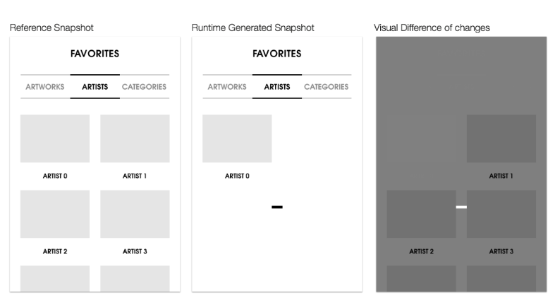
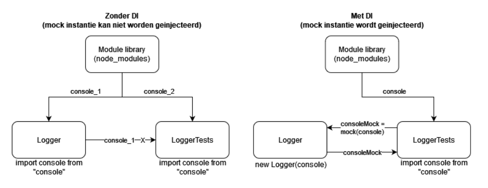
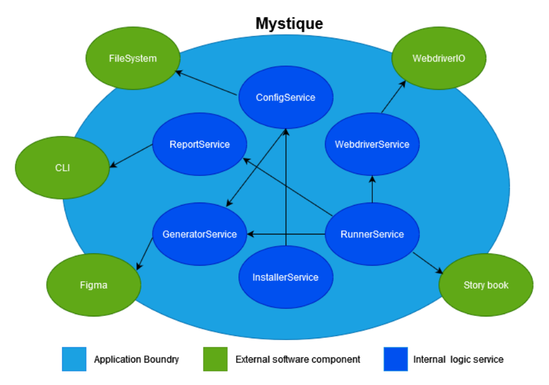
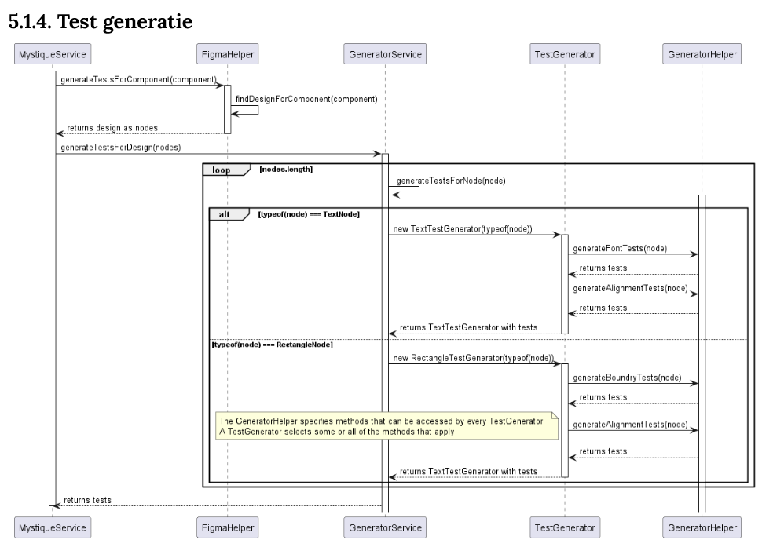
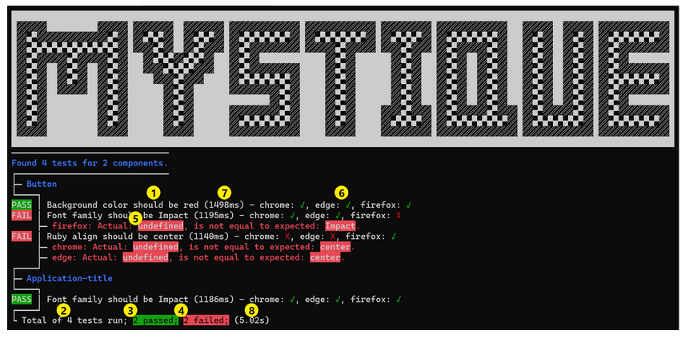

import DownloadButton from "../../components/download-button/download-button.astro"

<DownloadButton title="Thesis (Dutch)" link="/docs/Scriptie.pdf" />
<DownloadButton title="Github" link="https://github.com/JortWillemsen/mystique" />

# Mystique _Automated front-end testing_

Mystique is a bachelor thesis research project to find out if automated front-end component testing is possible, based on front-end user-interface designs. To achieve this, a custom cli utility was created that communicates with Figma to extract testable properties from user-interface designs that can be turned in to unit-tests.

## Motivation

Front-end software is least likely to be tested by developers. Especially large front-end projects experience visual bugs and inconsistencies. These can only be found by manually going through the web application each time a developer changes something. To do this thoroughly is a long and intensive process that companies would rather be investing in developing new functionality to create additional business value.

To reduce visual inconsistencies a lot of developers already work with user-interface designs generated in tools like: Figma or Adobe XD. These designs can give the developer a better reference to compare with.

## Goals

Reduce visual bugs and inconsistencies before they get pushed to the live production environment and reduce the time it takes to find these visual bugs and inconsistencies by automating the process as much as we can.

## Research Questions

How can a user-interface test be generated for a front-end component that compares properties from the design with implemented code, such that the cohesiveness between design and component can be guaranteed?

### Subquestions

- How can a front-end component test be written that validates user-interface design properties?

- How can a front-end component test be adapted to work for most modern front-end frameworks?

- To what capacity can properties extracted from a user-interface design be used to generate a test specification?

## How can we write such a test?

Testing front-end components is a concept that developers have been working on for years. Especially as accessibility becomes increasingly important, the connection between design and implementation has become essential.

### What is a test?

A software test, according to IBM (s.d.), is a process to evaluate and verify that a software product or application does what it is supposed to do. It helps a programmer discover and monitor difficult
predictable situations that may lead to software errors.

| Functionality | Development   | Adaptability    |
| ------------- | ------------- | --------------- |
| Correctness   | Efficiency    | Flexibility     |
| Reliability   | Testability   | Reusability     |
| Usability     | Documentation | Maintainability |
| Integrity     | Structure     |                 |

_Testable quality factors according to Pan (1999)_

Pan (1999) observes that software quality cannot be tested directly. However, a number of
factors can be tested that reveal quality as shown in Table 4.
For the purposes of this assignment, certain factors from the
quality categories: Correctness, Testability and Structure. These factors are translated within the
context of the assignment translated to:

- **Correctness**, To what extent are the properties of the user-interface design and the
  implemented component equal to each other?
- **Integrity**, Correctness in different browsers
- **Testability**, How many tests can be generated based on the nodes of the
  design and the implemented component?
- **Structure**, How complex is the implemented structure of the component compared to the structure of the design?

To test these factors, a testing framework is needed. The factors chosen in the
context of the assignment, however, are so specific that it is necessary to investigate whether existing
testing frameworks can be adapted to include the desired factors in the test, or whether a proprietary testing framework needs to be written.

Unadkat (2022) of BrowserStack finds Jest, Mocha or Jasmine to be the best options for testing javascript
frontend code testing. The downside is that these frameworks are not well adaptable
for the purposes of this assignment.

### Snapshot testing

Testing frameworks such as Jest, Mocha and Jasmine use: snapshot testing, a technique to
test the visual state of a component (Trinh, 2020). To create a snapshot, the component is
the component is rendered after which a picture of it is taken. This is kept next to the
component as a "correct state." When something changes in the component, a new snapshot is
a new snapshot is taken and compared to the "correct state". If these do not
match, alarm bells go off and the developer sees that something is wrong (Snapshot
Testing - Jest, 2023).
Trinh (2020) sees that Snapshot testing is the most common way to test the state of a
front-end component to be tested. It compares the new state with a previous state that we
know is correct. It takes a picture and does not look at the actual values of the
component (Jest, s.d.).
This kind of testing is done completely automated. As a result, the user / developer has no influence on the properties being tested. A goal of the assignment is to have clear logging during testing about what went wrong and why.
Snapshot testing does not indicate what the values were of the failed tests, only that a
visual difference was detected.

_Snapshot testing (Therox, z.d.)_

#### Disadvantages

- Every framework expects special test files to be created in which the
  specification of the test is written in.
- Frameworks use snapshot testing to detect visual bugs, which offers little
  semantic value.

These drawbacks make standard test frameworks not adaptable enough for
this project. One option is to develop your own test framework. To investigate
what this would require, the most widely used front-end testing frameworks were put side by side
to see what all the similarities are. The most commonly used front-end testing frameworks
are: Jest, Mocha and Jasmine (Unadkat, 2022b; Singh, s.d.; "JavaScript Unit Testing Frameworks in
2022 A Comparison," 2022). All testing frameworks include the following elements in their
architecture to run a test:
(I) the test specification, (II) the test assertion framework, (III) the test runner, and (IV) the
test report (Architecture - Jest, 2023; Mocha - the Fun, Simple, Flexible JavaScript Test
Framework, 2023; Karma - Spectacular Test Runner for Javascript, s.d.).
The following diagram describes the implementations of these elements by testing
framework.

### Test specification

For this assignment, the intention is to automatically generate tests based on
the user-interface design. This means that in the solution being realized, a number of
test specifications are created that based on the properties contained in the design can be
can be modified to test the correct properties. In sub-question 3, we will
discusses what types of test specifications can be created.
During specification generation, the test framework must retrieve the design for each
component to be tested, the design must be retrieved. Based on the design, the test framework generates
the specifications. The intention is to pass these specifications along to the test runner
to execute them.

### Test assertion framework.

Durand & Curran (2012) state an assertion is a testable or measurable expression to compare an
implementation against a statement made about it. Assertions provide
confidence in the test and can provide a basis for code coverage analysis.
There are libraries that provide this functionality. According to Kandi, a SaaS tech company that
builds millions of open source code accelerators, Chai, (11 Best JavaScript Assertion Libraries
by 2023 | Kandi, s.d.)
This framework has features to compare values, catch exceptions or situations to
expectation.

### Test runner

Every test must be executed. To do this, a test runner is needed. This can find the test
find, call the assertion library, and store the result of the assertion and pass it to
the test report. In the context of this assignment, the runner is responsible for the following
functionality:

- Making the component under test available
- Reading the component
- Processing the test specification
- Calling the assertion
- Processing the result of the test

#### Rendering

To test the user-interface properties of a component, the component must be
be rendered. This way, the test runner looks at the component and
properties of the component can be compared with properties from the
user-interface design. Preferably, this is not done by running the application because then
too many elements can be seen on the page that are not interesting for testing the
component and it takes longer than necessary to run the application.

#### Storybook

One possible solution to render component separately is Storybook. Storybook is a virtual
workshop to develop user-interface components in isolation (Storybook: Frontend
Workshop for UI Development, s.d.). It can help find difficult edge cases without
running the complete application. It offers many integrations with third-party tools to extend the
functionality of Storybook. These are what Storybook calls: "addons."

#### Addons

To expand the functionality of Storybook, the developers came up with addons. Addons can be developed by anyone and have been very important to the success of Storybook. Among other things, there are addons to test accessibility, add designs to your component or highlight certain features of the component (Integrations | Storybook: Frontend Workshop for UI Development, s.d.).
An addon can be written for Storybook to compare a user-interface design with the implemented component given Storybook takes responsibility for rendering the components and being able to access them from the addon. For this purpose, the panel pattern (Types of Addons, n.d.) can be used to add an additional panel for each component to Storybook's UI that shows the results of the generated tests to the developer.

#### Advantages

The biggest advantage of Storybook is (I) that it takes a lot of worries away from you. It is a production complete environment that supports many features and functionality. (II) Addons are easy to install in any project and Storybook is largely framework abstract. It supports: React.js, Angular, Vue.js and web components (Storybook, Made for, s.d.). (III) This means that for the most part it is a plug-and-play situation that can be used in many Info Support projects.

#### Disadvantages

There are some disadvantages to using Storybook: (I) It introduces additional features and functionalities that are not always needed in a project. A subset of these features are only used for the purpose of this assignment. (II) Storybook is framework abstract but not for all frameworks. It does not support frameworks like Svelte and SolidJS so it may not be future-proof enough. (III) Setting up Storybook requires a complete reordering of a project if it already exists. It is a huge operation to introduce Storybook. (IV) Addons only provide per-component support. This means that only when a specific component is viewed can addon tests be run for it. Storybook cannot run an addon that can go through all components at once to create a test report. This would have to be done manually.

#### Web drivers

Storybook has its own way of viewing and interacting with rendered components, but when more precision and control is expected, web drivers are used to enable this functionality. A Web driver is a remotely controllable interface that allows a user to instruct a browser in an implementation abstract manner. The best-known examples of Web drivers are Selenium, WebdriverIO and ChromeDriver. Frameworks such as Cypress and Playwright also have built-in Web drivers to properly execute their tests. Underwater, almost all implementations use Selenium to render the Web page.

#### Standalone

The most important thing for a Web driver is that it can run in a standalone version. That means it is not attached to a testing framework. This testing framework requires test files that conform to a specific syntax that do not test the features that are important to this project and work in an automated fashion that does not allow functionality to be added.

A standalone web driver means that a browser instance can be created from code that controls the way the user wants. It can retrieve DOM elements (Introduction to the DOM - Web APIs | MDN, 2023) and styling properties as well as perform actions that simulate a real user such as a mouse click or a page scroll.

WebdriverIO works in a standalone mode while cypress does not support it. Storybook works very well on a "per component basis" but cannot handle as well as a test runner who wants to test multiple components simultaneously. Storybook is also very large and expects a restructuring of code and a different mindset when developing front-end applications.

#### Combining Storybook and Webdrivers

To take advantage of the flexibility offered by WebdriverIO, the component does need to be rendered so that the Webdriver can access it to run its tests. One problem is that there are few ways to render components without building your own solution for that particular framework. This is not a good way because it generates a lot of overhead, especially since all that is needed is testing. For each framework, the way to render is completely different.
Fortunately, Storybook does offer a solution for this. Storybooks framework abstract rendering can be used to make the components available to WebdriverIO. Storybook still has the disadvantages as described earlier, but these are always better than the extra complexity and time involved in building your own solution. Rendering the component is not the main focus of this project at this time.

### Test Report

It is important that the result of a test is stored properly, so that at the end of the test run the result can be displayed and the user gets a clear overview of what went right or wrong.

| Information                        | Quality Factor | Explanation                                                                                                          |
| ---------------------------------- | -------------- | -------------------------------------------------------------------------------------------------------------------- |
| Test name                          | -              | Indicates which test was run. Also states whether it passed or failed.                                               |
| Total number of tests run          | Testability    | Indicates how many tests were generated and run during this test run.                                                |
| Number of successful tests         |                |                                                                                                                      |
|                                    | Testability    | Indicates how many tests passed. If all tests passed, the test run is successful.                                    |
| Number of failed tests             |                |                                                                                                                      |
|                                    | Testability    | Indicates whether any tests failed. If so, the test run failed.                                                      |
| Why a test failed                  | Correctness    | If a test failed, indicates where why it failed so that it can be resolved as soon as possible.                      |
| Total duration of the test run     | Testability    | In seconds. Indicates how long a test run took.                                                                      |
| Browser in which the test was run. | Integrity      | Which browser was used to test the component, so the user knows if a particular browser is rendering it incorrectly. |
| Run duration of one test.          | Testability    | In milliseconds. Indicates how long a test took.                                                                     |
| Difference in complexity.          | Structure      | How many more or fewer nodes the DOM has compared to the design.                                                     |

_Information displayed in a test report_

The table above shows what information Jest displays at the end of a test run. The name of
each test is displayed along with whether it passed or failed. If it failed
it also shows where the test failed in the code. It is important that the information in
Table 5 is incorporated into a test report (Geek, 2022). This information provides an insight into the
quality factors tested that are important to this project.

## How can the generation of a test be automated?

To automate a test, all parameters for the test must be obtainable through code. Thus, because properties of the design are compared with the properties of the component, both will have to be known before the test can be generated.

### Design platform

Both Stevens (2023) and Cahill and May (2023) and Maze (2023) recently indicate that there are multiple design platforms available to develop designs with. Given that it is not possible to pay for a design platform for this project, we have chosen to display only platforms that have a free version available.
For this project, the platform is also expected to support reading the design file on demand.

| Platform | Key features                                                                  | Design file on demand                                                                                                                                                                                                                                                                         |
| -------- | ----------------------------------------------------------------------------- | --------------------------------------------------------------------------------------------------------------------------------------------------------------------------------------------------------------------------------------------------------------------------------------------- |
| Adobe XD | <ul><li>Workflow integration</li><li>Element creation (interactable & reusable)</li></ul>    | Adobe XD provides a scriptable API to develop plugins. Adobe states that plugins provide support for creating designs, collaborating on designs, and sharing designs with other people. So it does not offer a solution for this project. (Adobe XD APIs for Developers and Scripters, s.d.). |
| Invision | <ul><li>Outline user journeys</li><li>Create design handoff features</li></ul>               | Invision offers many integrations with other tools including Google Docs and Jira. but has no way to manually or automatically retrieve design files (Invision, 2023).                                                                                                                        |
| Framer   | <ul><li>Close to production prototyping</li><li>First-party HTML & CSS integration</li></ul> | Framer offers "Custom page code" and "code overrides." Ways to customize the user interface within Framer and add functionality. It has no way to export designs (Framer: Developers, s.d.).                                                                                                  |
| Figma    | <ul><li>Cloud-based design</li><li>Collaboration tools</li><li>Browser-based interface</li></ul>  | Figma provides a REST API that allows a JSON representation of the design from which specific properties can be extracted (Figma, s.d.).                                                                                                                                                      |

The table above shows that there are multiple design platforms available, all of which have their own reasons for using them. There is only one platform that provides the support needed: Figma. Using the REST API, a JSON representation of the design can be read that contains the properties needed for comparison.

### Design properties

| Type | Corresponding HTML tag | Function     | Distinguishing properties |
| ---- | ---------------------- | ------------ | ---------- |
| ---  | p, h1, h2, h3          | Display text | font-family, font-size, text-alignment, characters |
| Rectangle | div, span | Display a rectangle as background or decoration | border-radius |
| Table | table | Display a table | number-of-rows, number-of-colums |

_Number of different Figma design nodes (Node Types, Plugin API, s.d.)_

A user-interface design for a component consists of several elements called nodes. A node contains information about that element of the design. Design platform Figma distinguishes several types of nodes (Node Types | Plugin API, s.d.). Table 7 lists some of those nodes that can be used for comparison because they resemble properties of an implemented component

Figma (s.d.) provides a Restful web API that allows these nodes, including properties, to be retrieved and viewed. These nodes and properties can then be compared to the properties of the implemented component.

### Component properties

Components written in Javascript frameworks are converted by Storybook to renderable HTML (Story Rendering, s.d.). This HTML code consists of two parts: a Document Object Model (DOM) and a Cascading Style Sheet (CSS). The DOM is a tree structure consisting of HTML tags that indicate what content is to be displayed on the page (Introduction to the DOM - Web APIs | MDN, 2023). The CSS is a file in which, for each node on the tree structure of the DOM, it can be specified how it will be presented (Keller & Nussbaumer, 2009).

A web driver is used to retrieve, through a query, CSS values found on an HTML tag. The webdriver chooses the appropriate HTML tag based on a selector. This can be a CSS class, id or other property (Selectors | WebdriverIO, s.d.).

### Comparison

| Unit | Abbreviation | Is equal to |
| --- | --- | --- |
| Centimeters|cm|1cm = 37.8px = 25.2/64in|
|Millimeters|mm|1mm = 1/10th of 1cm|
|Quarter-millimeters|Q|1Q = 1/40th of 1cm|
|Inches|in|1in = 2.54cm = 96px|
|Picas|pc|1pc = 1/6th of 1in|
|Points|pt|1pt = 1/72nd of 1in|
|Pixels|px|1px = 1/96th of 1in|
|Hexadecimale|#|-|
|RGB|rgba|-|
|Percentage|%|-|

_Absolute CSS units (CSS Values and Units - Learn Web Development | MDN, 2023)_

It is important that Figma and CSS use the same units so that it is as accurate and easy as possible to compare whether the values are equal to each other. According to MDN, the table above lists the absolute units known to CSS (CSS Values and Units - Learn Web Development | MDN, 2023).

Figma is a lot more ambiguous about the use of units and in the API documentation only indicates whether the value in the JSON representation in the code can be expressed a number, string or other unit. Bash (2023) answers the question, "What Is the Measuring Unit in Figma?" posed March 8, 2023, that Figma uses pixels for dimensional values such as length, width and distance.
For color, Figma indicates in the color picker (Figure 9) that it supports both hexadecimal and RGB units. For values where percentages are expected, Figma can also handle this given that percentages are constantly used to recognize transparency values.

Using the pixel, hex, rgb and percentage units allows for good translation between CSS and Figma. One just needs to pay close attention to which unit Figma uses for values that are not immediately obvious.

## Architecture

The product aims to improve the consistency between the user-interface design and the implemented component. To do this, it has been studied that a tool needs to be built that can (I) communicate with the design platform Figma, (II) integrate with a project to be tested, (III) communicate with components to gather properties and (IV) start a test after which a report is shown with the results. This product has to be built and for that a number of things are important that are discussed in this chapter such as how the product was built, what tools were used and what was finally realized.

### NodeJS CLI Application

Mystique will integrate with existing front-end projects written primarily in Javascript or Typescript. To make this collaboration as easy as possible, it was chosen, over other languages and techniques such as Python, c# or Java, to create a node.js application. Decan et al. (2018) indicates that for javascript projects, Node.JS and npm are used more than other package managers. If the public is to access Mystique, it will need to be available within package managers. Support for npm is very important in this regard. In fact, npm only supports Node.js packages (Npm About, s.d.).
In order to create as little overhead as possible, we chose not to use a javascript bundler. Bundlers can cram javascript into 1 file together so that it reaches the user over the Internet as easily as possible. For an npm package, this is not necessary and Typescript projects can just as easily use the TSC compiler to convert the application to a javascript distribution folder that can be uploaded to NPM. (You May Not Need a Bundler for Your NPM Library, 2022).

### Dependency injection

_Using dependency injection to mock ESM_

Given that the product uses Typescript making ECMAScript modules (ESM) (JavaScript Modules - JavaScript | MDN, 2023) a given, it is important that these modules can be mocked when needed in a unit test (Zhu et al., 2020). If an ESM is imported into a class then it cannot be mocked by the test class because they both import a different instance of the module. As a result, the mocking library cannot modify or spy on that module, as shown in Figure 10. The Logger class from the figure imports an instance of console itself and the LoggerTests class cannot access this instance to mock it.

By using dependency injection (DI), the developer himself has control over the instance of the ESM that is passed along to the class (Smith et al., 2007). Figure 10 shows that the LoggerTests class can itself create a mock of its imported instance and passes it to Logger through the constructor.

For this project we chose to use TypedInject (Nicojs, s.d.) as dependency injection library because it was developed by Nico Jansen, an employee of Info Support and therefore Info Support has a lot of experience with TypedInject. Another advantage is that it is a 100% type safe injection library, so it works very nicely with Typescript.

_Architecture diagram_

In the picture above, you can see that there are six services created that contain the core of the application. In them the tests are generated and run, the application is installed and the configuration file is read. These services are shown as blue.

They communicate with software components outside the application. These are external applications, services or tools required for the application to work correctly. These are shown in green and are outside the application. There is always a service responsible for communicating with one of these external software components.

The entire light blue border around the six services is the boundary of the application. Everything within this border is included in the package that will eventually be delivered to the user.

### Test generation

_Test generation sequence diagram_

An important and complex part of the application is test generation. A software quality requirement established in the plan of action expects the least amount of duplicated code possible to generate and run tests for different components. Figure 12 describes how generation currently works. The generator service looks at what type the node is and, based on that, executes a generation strategy that generates the correct tests. All the possible tests that can be generated are described in the GeneratorHelper. Every TestGenerator has access to this and selects the correct one for the node type. 

This ensures that every possible node can use the same tests and the test generation does not depend on the node type. As a result, all types of tests only need to be described once and each time a new node needs to be made testable, a new TestGenerator can be created that selects the appropriate tests for that particular node type.

## Finished Product

The application has several functionalities. The main functions are: installing Mystique in the project to be tested, generating the tests and running them.

### Installation 
Mystique must be connected to the project under test. This is done through an installation command. This command is included with the installation of Mystique on the local system and can be connected to any project from there.

When the command: **mystique --install** is run in the terminal, Mystique is going to run several checks to find out if it is possible to attach mystique to the project. The first check performed is to look for Storybook since Mystique cannot work without Storybook and thus expects it to be present. If it is not, it returns an error indicating that Storybook cannot be found and therefore aborts the installation. Second, it checks if Mystique has access to the computer's files because a configuration file needs to be pasted. If Mystique does not have access, an error message is given for this as well.

When the checks are over, Mystique can be connected to the project. This is done by pasting a configuration file into the project's root directory. This file is called: mystique.config.json. And is a JSON file that contains the Storybook url found and an empty list of components that can be filled with predefined tests.

When the installation of Mystique is complete, it is indicated in the terminal, after which possible commands are described that can be executed by the user.

### Generating tests

The most important part of the application is generating the tests. This can be done in two different ways. The first and easiest way is to read the configuration file. The second way queries the Figma design and tries to derive tests from what Mystique recognizes.

Once the tests from the configuration file are included, a check is made to see if a Figma ID is passed to the terminal output command. If so, the user is asked to log in to Figma. This is done to access the designs the user has created under his/her account. Upon logging in, a web page is opened where user login credentials can be entered. Figma authenticates the user and, through an HTTP request, forwards the user's OAuth data to the application (Figma, s.d.-b). From then on, this OAuth data can be used to send requests to Figma's Web API to gain insight into the user's user-interface designs. By providing the Figma API with the ID, we request the proper design document. The document is written in JSON format and can be converted to a Typescript object at once. Now that the design is known, tests can be generated. The design contains nodes that make up a document. Each node can be of a different type. The most common types are: Rectangle, vector and text. The application looks at each node to find out if tests can be generated for it. When a node is found that can be tested, tests are generated for it that follow predefined guidelines. For example, for a text node, a test is always generated that checks if the font size is correct. 

### Executing tests

Once all the tests are generated, they are passed to the runner who will run them and show the result to the user. Before running the tests, the CLI displays how many tests need to be run. When this is done, the tests are executed one at a time. The Web driver checks if the component being tested actually exists by navigating to the page where it should be found. If this page is not found or Storybook does not respond, an error message is displayed.

When the web driver contacts the component, the values from the test specification are used to find the correct HTML tag in the component after which the correct property and value is retrieved. 

The value retrieved by the web driver is compared to the expected value contained in the specification. If the two values are equal, a positive test result is stored. Should the values not be equal, a negative test result is stored with an error message indicating why the test failed. These results are handed over to the report after running all the tests to display the results to the user via the CLI.

### Report

| Nr | Information |Quality factor | Explanation |
| --- | --- | --- | --- |
|1|Test name|-|Indicates which test was run. It also states whether it passed or failed.|
|2|Total number of tests run|Testability|Indicates how many tests were generated and run during this test run.|
|3|Number of successful tests|Testability|Indicates how many tests passed. If all tests passed, the test run is successful.|
|4|Number of failed tests|Testability|Indicates whether any tests failed. If so, the test run has failed.|
|5|Why a test failed|Correctness|If a test failed, indicates why it failed so that it can be resolved as soon as possible. |
|6|Browser in which the test was run.|Integrity|Which browser was used to test the component, so the user knows if a particular browser is rendering it incorrectly.|
|7|Run duration of one test|Testability|In milliseconds. Indicates how long a test took.|
|8|Total duration of test run|Testability|In seconds. Indicates how long a test run lasted.|

